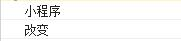
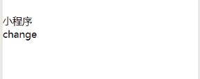
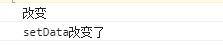
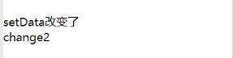

#小程序学习
## setData
在js中直接修改data是无法触发视图的更新。需要用setData来实现更改data更新视图的目的。
```
<view style="margin-top: 50rpx;">
	{{title}}
    <view bindtap="change">change</view>
</view>
js:
	data: {
		title: '小程序',
		list:['a','b','c','d']
	},
	change:function(){
		let title = this.data.title;
		console.log(title);
		this.data.title = '改变';
		console.log(this.data.title);
	}
```
结果如下，data里的值发生了改变，但视图并未更新。

 

```
<view style="margin-top: 50rpx;">
	{{title}}
    <view bindtap="change2">change2</view>
</view>
js:
	change2:function(){
		this.data.title = '改变';
		console.log(this.data.title);
		this.setData({
			title: 'setData改变了'
		})
		console.log(this.data.title);
	}
```
结果如下，data里的值改变了，并触发了视图的更新。



### setData改变对象的值
1. 全部改变
```
data:{
	arr: [
		{
			a: 'aaa',
			b: true
		},
		{
			a: 'bbb',
			b: false
		}
	]
}
change3:function(){
	let arr = this.data.arr;
	for(let i=0;i<arr.length;i++){
		arr[i].b = !arr[i].b
	}
	this.setData({
		arr: arr
	})
}
```
2. 改变部分值
```
change4:function(){
	//改变arr[0].b的值
	//1.
	this.setData({
	  	'arr[0].b': false
	})

	//2.
	let b = 'arr[0].b';
	this.setData({
		[b]: false
	})
}
```


