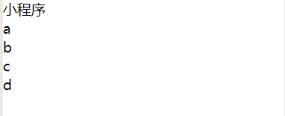
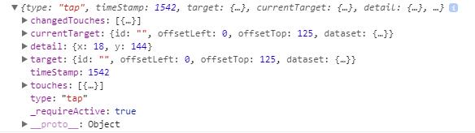

# 小程序学习
##  wxml
### 数据绑定：使用{{}}
```
wxml: 
	<view>{{title}}</view>
	<view wx:for="{{list}}" wx:key="{{index}}">
		{{item}}
	</view>	
js:       
	Page（{
		data：{            //只能通过setData改变data里的值
			title: '小程序',
			list:['a','b','c','d']
		}
	}）
```



### 列表渲染：  wx:for
```
<block wx:for="{{arr}}">
		<view>{{index}}--{{item}}</view>
</block> 
     /*   默认下标 index，当前项默认为item
          可以使用wx:for-item="list" 将默认item改为list
              使用wx:for-index="ix"  将index改为ix   
     */
```
### wx: key  保证列表中项目的唯一性
```
可以提供2种值
   1.字符串
   2.*this  关键字
在使用wx：for时，{{}}与“”之间不能有空格，有空格则会将其转换成字符串
```
### 条件渲染：
#### wx:if ： 是否渲染
```
wx: if = "{{}}"      // if   true渲染
wx：elif = "{{}}"    // else if   true渲染  
wx：else             // else    else渲染
```
#### hidden：隐藏 ，使用dispaly来控制显示隐藏
```
hidden="{{hide}}"  // hide=true时隐藏，false显示
```
### 事件
bind:事件类型 或 bind事件类型  bind事件绑定不阻止冒泡
如：
```
bind:tap              bindtap               触摸事件
bind:longtap          bindlongtap           长按事件
```
catch:事件类型 或 catch事件类型   catch事件绑定阻止冒泡
如：
```
catch:bind            catchtap          
catch:longtap         catchlongtap
```
事件使用：
```
<view bindtap="click">test</view>  // 触摸后触发click函数
js:
	click:function(e){   // 事件处理函数接收一个参数e
		console.log(e)
	}
```
以上打印出如下



### 模板，使用is属性获取使用的模板，is属性也接受一个三元表达式使用不同的模板
```
<template name="tem">
	<view>{{name}}</view>
	<text>{{age}}</text>
</template>

<view wx:for="{{arr}}">
	<template is="tem" data="{{...item}}" />
</view>
```


### 引用，import 和include  可以使用其他wxml中的模板
```
    <import src="item.wxml"/>
    <include src="item.wxml"/>
    import 有作用域，只能在引用了的wxml中使用
    include相当于帮引入的文件拷贝到include位置上 
```

## wxss
与css一致，多了一种尺寸单位rpx
### rpx：可根据屏幕进行自适应


