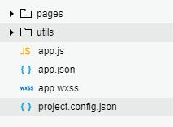
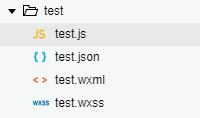
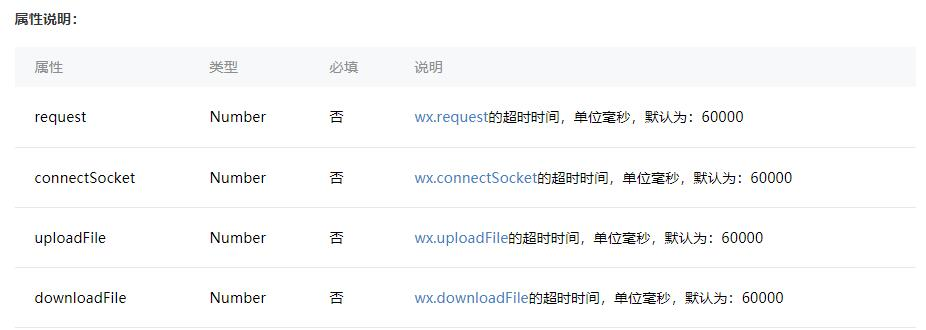
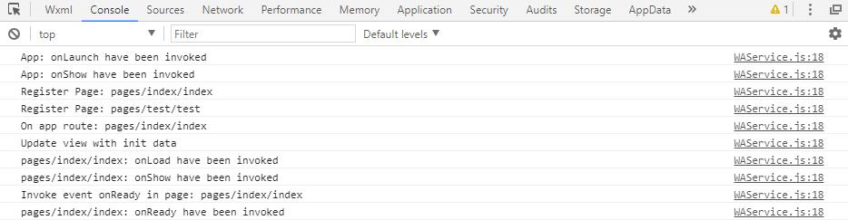

# 小程序
## 目录结构
小程序的基本目录结构包含pages文件夹、utils文件夹、以及全局的配置文件。


### pages文件夹
该文件夹用于存放小程序页面，每个页面为一个文件夹，包含4个文件，4个文件的文件名需相同。



*.js :  该页面的js文件，实现页面交互。
```
let app = getApp();  //通过getApp（）获取全局App实例
Page({
  /*页面的初始数据*/
  data: {},
  
  /* 生命周期函数--监听页面加载*/
  onLoad: function (options) {
	console.log(app.globalData.a)  
  },
  
  /*生命周期函数--监听页面初次渲染完成*/
  onReady: function () {},

  /*生命周期函数--监听页面显示*/
  onShow: function () {},

  /* 生命周期函数--监听页面隐藏*/
  onHide: function () { },

  /* 生命周期函数--监听页面卸载*/
  onUnload: function () {},

  /* 页面相关事件处理函数--监听用户下拉动作 */
  onPullDownRefresh: function () {},

  /*页面上拉触底事件的处理函数*/
  onReachBottom: function () {},

  /*用户点击右上角分享 */
  onShareAppMessage: function () {}
})
```
*.json：该页面的配置文件。
*.wxml：页面结构，类似html。
```
<view>test</view>
<image></image>
```
*.wxss:  页面样式，同css
```
.user{
	width: 300rpx;  
	height: 100px;
}
```


### 全局配置文件
#### app.js
小程序全局逻辑，需要一个App()函数，该函数接受一个object
```
{
	onLaunch: //小程序初始化
	onShow:   //小程序显示	
	onHide:   //小程序隐藏
	onError:  //错误监听
	onPageNotFound:   //页面不存在
	globalData:   //全局数据
}
```
#### app.json
小程序全局配置：
###### pages：小程序页面路径   （Array）
```
"pages":[
	"pages/index/index" // 第一项为小程序打开时的页面
	"pages/logs/logs"
]
```
###### window：小程序窗口表现    （Object）
```
"window":{
    "backgroundTextStyle":"light",
	"navigationBarBackgroundColor": "#ca2100",  //导航栏背景色
    "navigationBarTitleText": "test",       // 导航栏文字
    "navigationBarTextStyle":"white"            // 文字颜色
  }  
```
###### tabBar：tab的表现     （Object）
```
"tabBar": {
		"color": "#666",                 //文字颜色
		"selectedColor": "#f00",         // 选中时文字颜色
		"backgroundColor": "#fff",       // 背景色
		"list":[           // tab列表，最少2个，最多5个（Array）
			{
				"pagePath": "pages/index/index",   // 页面路径，必须在pages的定义的
				"text": "主页",                    // tab文字
				"iconPath": "./img/all.png",       // icon路径
				"selectedIconPath": "./img/all.png"     // 选中时icon路径
			},
			{
				"pagePath": "pages/test/test",
				"text": "我的",
				"iconPath": "./img/account.png",
				"selectedIconPath": "./img/account.png"
			}
		]
	}
```
效果：


###### networkTimeout：设置网络请求的超时时间    （Object）


###### debug：是否开启debug       （Boolean）
```
"debug": true
```
效果：


#### app.wxss   全局样式
```
*{
	margin: 0;
}
::-webkit-scrollbar{   // 隐藏scroll-view的滚动条
	width: 0;
	height: 0;
	color: transparent;
}
```

