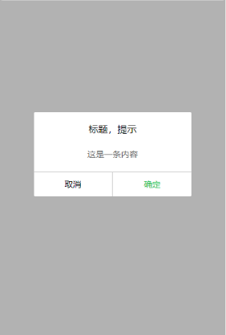

#小程序学习
## 内置组件
1. view：视图容器，块级元素（div）
2. text： 文本，行内元素
3. scroll-view： 可滚动视图容器
```
<scroll-view 
	scroll-y      // 纵向滚动  scroll-x：横向滚动
	scroll-into-view='{{into}}'   // 滚动到id为into的子元素
	scroll-with-animation='{{true}}'>  // 设置滚动动画
</scroll-view>
```
4. swiper：[滑块视图容器](./pages/swiper/)。 
```
<swiper 
  	current="{{current}}"   // 当前滑块的index
	bindchange='swiperChange'  // 滑块改变时触发
	indicator-dots='{{dots}}'  // 指示点
	autoplay='{{autoplay}}'   // 自动切换
	circular='{{circular}}'>   // loop形式
    <block wx:for="{{imgUrls}}" wx:key='index'>
      <swiper-item>
        <image src="{{item}}" class="slide-image" />
      </swiper-item>
    </block>
 </swiper>
data: {
		imgUrls: [
			'http://img02.tooopen.com/images/20150928/tooopen_sy_143912755726.jpg',
			'http://img02.tooopen.com/images/20150928/tooopen_sy_143912755726.jpg',
			'http://img06.tooopen.com/images/20160818/tooopen_sy_175866434296.jpg',
			'http://img06.tooopen.com/images/20160818/tooopen_sy_175866434296.jpg',
			'http://img06.tooopen.com/images/20160818/tooopen_sy_175833047715.jpg'
		],
		current: 0,
		dots: false,
		autoplay: false,
		circular: false
	},
```
5. image：图片(img)
```
	<image src='./img//a.png'></image>
```
6. icon：图标
```
	<icon type='success' size='30' color='#fff'></icon>
	type: icon类型
	size: icon大小
	color: icon颜色
```
7. navigator：链接（a）
```
	<navigator url='./a/a'>跳转</navigator>
```

4. 

## 自定义组件
1. 新建一个component（右键--新建--Component），将生成与页面一样的4个文件
2. 在*.json文件添加以下内容
```
 {
     "component" : true
 }
```
3. 组件模板与样式wxml和wxss，与页面方式一样。（wxss不可以使用id选择器、属性选择器和标签选择器）
```
<view class='mask' wx:if="{{show}}">
    <view class='model'>
         <view class='title'>{{title}}</view>
         <view class='content'>{{content}}</view>
         <view class='btn'>
              <view class='cancel' bindtap='_cancel'>{{cancel}}</view>
              <view class='confirm' bindtap='_confirm'>{{confirm}}</view>
         </view>
    </view>
</view>
```
4. Component构造器 （可使用setData改变properties和data中的值）
```
Component({
	properties: {      // 组件的对外属性，在组件外可通过 title=“新标题” 的形式改变默认值
		title: {
			type: String,
			value: '提示'
		},
		content: {
			type: String,
			value: '提示内容'
		},
		cancel: {
			type: String,
			value: '取消'
		},
		confirm: {
			type: String,
			value: '确定'
		},
		show:{
			type: Boolean,
			value: false
		}
	},
	data: {                           // 组件data，
		
	},
	methods: {
		// 组件内部方法，建议使用  _  开头明名
		_cancel: function () {
			this.triggerEvent('cancel')   // triggerEvent 触发cancel事件
		},
		_confirm: function () {
			this.triggerEvent('confirm')
		}
	}
})
```
5.  使用，在需要使用组件的页面的.json文件中添加如下代码 
```
"usingComponents": {
	"model": "../../components/dialog/dialog"   // 组件名： 组件路径
}
```
在wxml中使用：
```
  <model show='{{show}}' title='标题，提示' content='这是一条内容' bind:cancel='cancel' bind:confirm='confirm'></model>
    <button bindtap='click'>btn</button>
```
js中处理事件逻辑：

```
click() {
	this.setData({
		show: true
	})
},
cancel: function () {
	console.log('取消')
	this.setData({
		show: false
	})
},
confirm: function () {
	console.log('确定')
	this.setData({
		show: false
	})
},
```
[代码](./components) 
效果如下：


